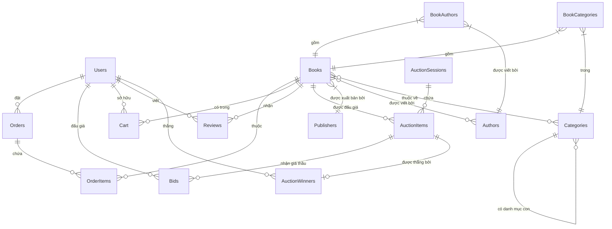
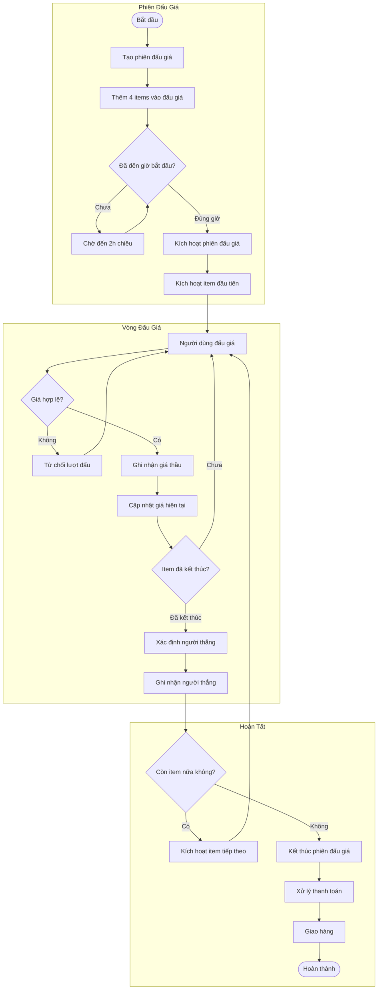
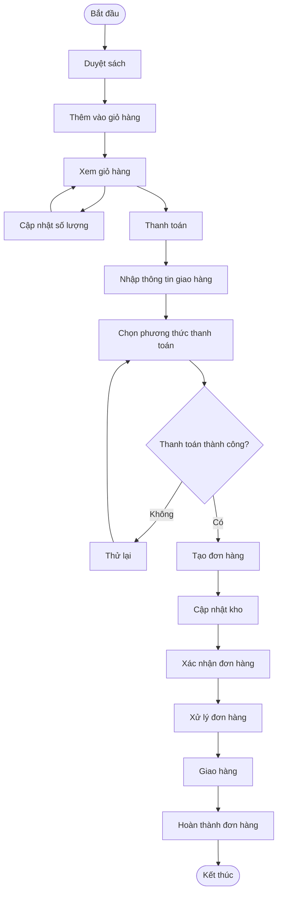
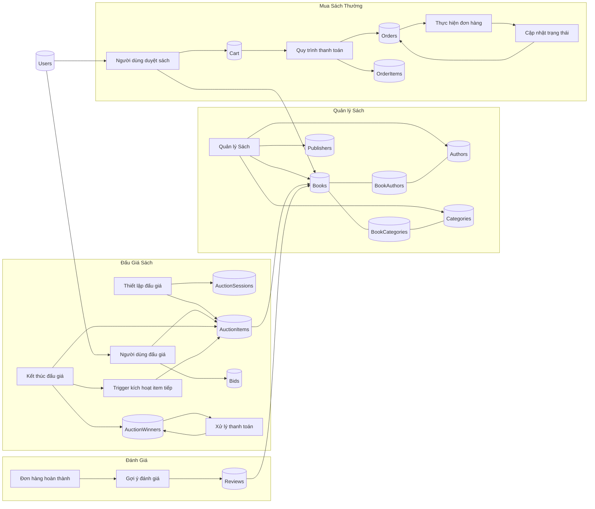

#Biểu đồ ER (Entity-Relationship):

Hiển thị mối quan hệ giữa các bảng trong cơ sở dữ liệu
Thể hiện rõ các mối quan hệ 1-1, 1-nhiều, nhiều-nhiều
Dễ dàng nhìn thấy cách các thực thể kết nối với nhau

Biểu đồ Luồng Đấu Giá:

Mô tả chi tiết quy trình đấu giá từ đầu đến cuối
Hiển thị các bước: tạo phiên, kích hoạt item, đấu giá, chuyển item tiếp theo
Bao gồm xử lý người thắng và thanh toán

Biểu đồ Luồng Đặt Hàng Thông Thường:

Mô tả quy trình mua sách thông thường (không đấu giá)
Từ duyệt sách, thêm vào giỏ, thanh toán đến giao hàng
Thể hiện đầy đủ các bước xử lý đơn hàng

Biểu đồ Luồng Dữ Liệu:

Phân nhóm các chức năng chính của hệ thống
Hiển thị cách dữ liệu di chuyển giữa các thành phần
Mô tả các quy trình nghiệp vụ chính

